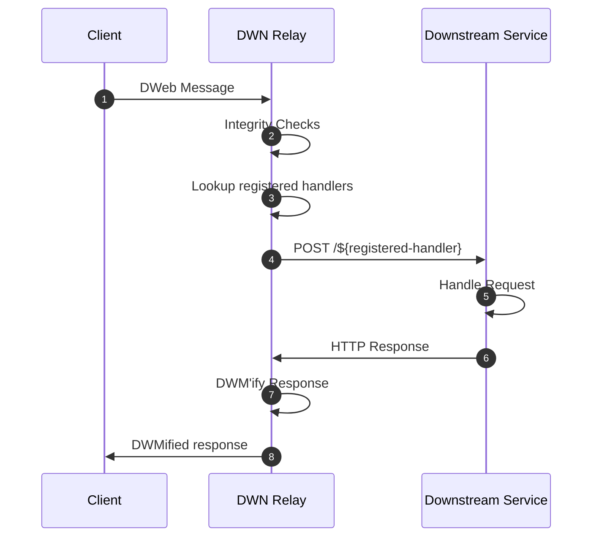

# DWN Relay

# Introduction

The primary motivation behind this project is to streamline the ability for traditional back-end services that expose RESTful APIs to consume DWN messages (a.k.a DWeb Messages). The default behavior of the Relay Service is designed to prevent the leakage of DWN awareness or concepts into a downstream service.

The Relay service runs as a standalone process that is separated by a network boundary. Inbound DWeb Messages are received by the relay service, integrity checked, and then relayed (aka proxied) to the downstream service.

Integration between the relay service and the downstream service is achieved by registering (a.k.a configuring) a _Handler_. A _Handler_ is a mapping between a specific set of DWN message properties and an HTTP API endpoint exposed by the downstream service. e.g. "When a DWN message is received that matches the filter: `{ "method": "CollectionsWrite", "schema": "https://tbdex.io/schemas/Ask", "protocol": "tbdex" }` send it to `POST https://somehost.com/some-endpoint`". Handlers are configured via a config file that is loaded by the relay service on startup.

More detailed info is available in the [design doc](docs/design-doc.md)

# Usage Instructions
⚠ **TODO**: Fill out

# Setting up for Development
Detailed instructions can be found [here](CONTRIBUTING.md)

# Project Resources

| Resource                                   | Description                                                                   |
| ------------------------------------------ | ----------------------------------------------------------------------------- |
| [CODEOWNERS](./CODEOWNERS)                 | Outlines the project lead(s)                                                  |
| [CODE_OF_CONDUCT.md](./CODE_OF_CONDUCT.md) | Expected behavior for project contributors, promoting a welcoming environment |
| [CONTRIBUTING.md](./CONTRIBUTING.md)       | Developer guide to build, test, run, access CI, chat, discuss, file issues    |
| [GOVERNANCE.md](./GOVERNANCE.md)           | Project governance                                                            |
| [LICENSE](./LICENSE)                       | Apache License, Version 2.0                                                   |