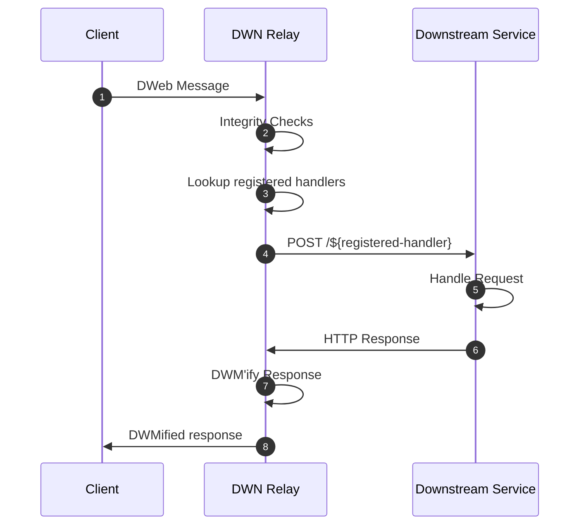

# DWN to HTTP/bridge

This is a Decentralized Web Node (DWN) to HTTP bridge that allows traditional back-end services to consume DWN messages (a.k.a DWeb Messages) using REST/http like apis. This can be used if you want to build a traditional back-end service that consumes DWN messages but don't want to have to deal with the complexities of the DWN protocol.

This is a purely optional and helper project, and not required to use DWNs.

# Using the bridge service

This service needs to run in a way that would be publicly accessible - so you can have its endpoint be available to be used in Decentralized Identifiers as a "service endpoint". This can be done by running it on a public server ideally in a DMZ. This may not be something you need.

If you don't need or wish to run a publicly accessible server, you can use DWN servers that are already hosted and the DWN client.
{TODO: add link to DWN client docs, and list of servers}

The bridge is configured with a config file that is loaded on startup:

```json
{
  "handlers": [
    {
      "filter": {
        "method": "CollectionsWrite",
        "schema": "https://ssi-schemas.org/CredentialApplication",
        "protocol": ""
      },
      "endpoint": {
        "method": "POST",
        "url": "https://somehost/some-endpoint",
        "requestOptions": {},
        "responseMapping": {
          "201": {
            "method": "CollectionsWrite",
            "schema": "https://ssi-schemas.org/CredentialApplication"
          }
        }
      }
    }
  ]
}
```

This directs the bridge to send all messages that match the filter to the endpoint you specify.

More detailed info is available in the [design doc](docs/design-doc.md)

# Example usage

The bridge is used in the web5 end to end test suite here: 

https://github.com/TBD54566975/web5-components-tests


# Design overview

The primary motivation behind this project is to streamline the ability for traditional back-end services that expose RESTful APIs to consume DWN messages (a.k.a DWeb Messages). The default behavior of the Relay Service is designed to prevent the leakage of DWN awareness or concepts into a downstream service.

Integration between the relay service and the downstream service is achieved by registering (a.k.a configuring) a _Handler_. A _Handler_ is a mapping between a specific set of DWN message properties and an HTTP API endpoint exposed by the downstream service. e.g. "When a DWN message is received that matches the filter: `{ "method": "CollectionsWrite", "schema": "https://tbdex.io/schemas/Ask", "protocol": "tbdex" }` send it to `POST https://somehost.com/some-endpoint`". Handlers are configured via a config file that is loaded by the relay service on startup.




# Setting up for Development
Detailed instructions can be found [here](CONTRIBUTING.md)

# Project Resources

| Resource                                   | Description                                                                   |
| ------------------------------------------ | ----------------------------------------------------------------------------- |
| [CODEOWNERS](./CODEOWNERS)                 | Outlines the project lead(s)                                                  |
| [CODE_OF_CONDUCT.md](./CODE_OF_CONDUCT.md) | Expected behavior for project contributors, promoting a welcoming environment |
| [CONTRIBUTING.md](./CONTRIBUTING.md)       | Developer guide to build, test, run, access CI, chat, discuss, file issues    |
| [GOVERNANCE.md](./GOVERNANCE.md)           | Project governance                                                            |
| [LICENSE](./LICENSE)                       | Apache License, Version 2.0                                                   |