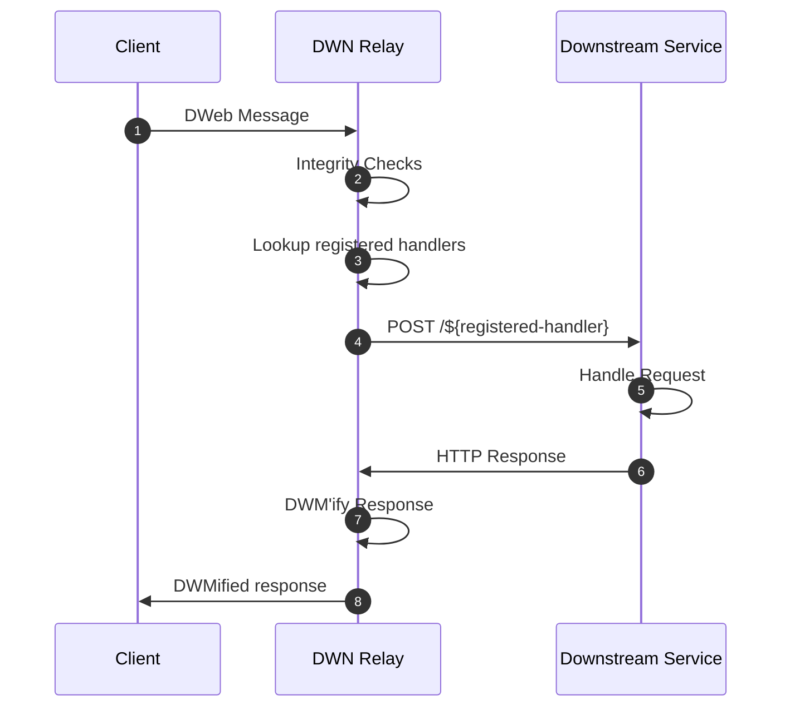

# [Proposal] DWN Relay Service Design Doc  <!-- omit in toc -->

# Contents <!-- omit in toc -->

- [Abstract](#abstract)
- [Handler Registration](#handler-registration)
  - [Config file](#config-file)
- [DWN Relay Message Handling](#dwn-relay-message-handling)
  - [Example Message](#example-message)
- [`DWN Relay -> Downstream Service` Request Payload](#dwn-relay---downstream-service-request-payload)
  - [Example](#example)
    - [DWeb Message](#dweb-message)
    - [Downstream Request Body](#downstream-request-body)
- [`Downstream Service -> DWN Relay` Response Payload](#downstream-service---dwn-relay-response-payload)
  - [Example](#example-1)
    - [Config](#config)
    - [Response from Downstream Service](#response-from-downstream-service)
- [`DWN Relay -> Client` Response Payload](#dwn-relay---client-response-payload)
- [DID / Key management](#did--key-management)
- [Additional Features](#additional-features)
- [Configuration](#configuration)

# Abstract
The primary motivation behind this project is to streamline the ability for traditional back-end services that expose RESTful APIs to consume DWN messages (a.k.a DWeb Messages). The default behavior of the Relay Service is designed to prevent the leakage of DWN awareness or concepts into a downstream service.

The Relay service runs as a standalone process that is separated by a network boundary. Inbound DWeb Messages are received by the relay service, integrity checked, and then relayed (aka proxied) to the downstream service.

Integration between the relay service and the downstream service is achieved by registering (a.k.a configuring) a _Handler_. A _Handler_ is a mapping between a specific set of DWN message properties and an HTTP API endpoint exposed by the downstream service. e.g. "When a DWN message is received that matches the filter: `{ "method": "CollectionsWrite", "schema": "https://tbdex.io/schemas/Ask", "protocol": "tbdex" }` send it to `POST https://somehost.com/some-endpoint`". Handlers are configured via a config file that is loaded by the relay service on startup.



# Handler Registration 

## Config file

⚠  **TODO**: Include every option
```json
{
  "handlers": [
    {
      "filter": {
        "method": "CollectionsWrite",
        "schema": "https://ssi-schemas.org/CredentialApplication",
        "protocol": ""
      },
      "endpoint": {
        "method": "POST",
        "url": "https://somehost/some-endpoint",
        "requestOptions": {},
        "responseMapping": {
          "201": {
            "method": "CollectionsWrite",
            "schema": "https://ssi-schemas.org/CredentialApplication"
          }
        }
      }
    }
  ]
}
```

# DWN Relay Message Handling
On ingress (step 1 in the sequence diagram), the DWN Relay Service will:
  - leverage the DWN SDK to process and store the message
    - ⚠  **TODO**: Decide on whether storage can be toggled off. Instinctively I think it makes sense to be able to toggle it off but that does have considerable implications. The most notable implication is that `protocol` cannot be adhered to without storage
  - base64url decode / decrypt `encodedData` within the message
    - ⚠  **TODO**: include details regarding which keys are being used to decode/decrypt the message
    - ⚠  **TODO**: include details regarding what happens if decoding/decrypting fails
  - send an HTTP request to the appropriate handler. Details about the request body are described [here](#dwn-relay---downstream-service-request-payload)

## Example Message
An example of a DWeb Message that a DWN Relay would receive from a client
```json
{
  "descriptor": {
    "target": "did:example:alice",
    "recipient": "did:example:alice",
    "method": "CollectionsWrite",
    "protocol": "6f06bc3c-55ed-4c9f-bccf-1b4345363473",
    "contextId": "1",
    "schema": "CredentialApplication",
    "recordId": "aa36ec55-c59b-4f20-8143-10f74aac696d",
    "nonce": "AXwHbetCnCCy8Q1ZSWE5X9yH1RKZ5ZXO",
    "dataCid": "bafybeihuzogd3utvlrw7dr3rb4kgzu43vqhlorvpzex33prwyqb777si5e",
    "dateCreated": 1663632617121,
    "dataFormat": "application/json"
  },
  "authorization": {
    "payload": "eyJkZXNjcmlwdG9yQ2lkIjoiYmFmeXJlaWVoaXVzZ214Y3Q0ejZieHg3emxsampyNzdybWdrNWlzbWZta3Rlcm1oeW5qMnp3aGkzczQifQ",
    "signatures": [
      {
        "protected": "eyJhbGciOiJFUzI1NksiLCJraWQiOiJkaWQ6ZXhhbXBsZTpib2Ija2V5MSJ9",
        "signature": "MEUCIQC1EC1A95c9Rs-0-_11QnJ0cuedKEPwAgfmDRLK-jVUYgIgd5agGdjriekepYLe94IXvdkID4lEiSTxqDgnF7SV8bs"
      }
    ]
  },
  "encodedData": "eyAicmVxdWVzdGVyRGlkIjogImRpZDp1c2VyOjEyMyIsICJhcHBsaWNhdGlvbiI6IHsgImlkIjogIjliMWRlYjRkLTNiN2QtNGJhZC05YmRkLTJiMGQ3YjNkY2I2ZCIsICJzcGVjX3ZlcnNpb24iOiAiaHR0cHM6Ly9pZGVudGl0eS5mb3VuZGF0aW9uL2NyZWRlbnRpYWwtbWFuaWZlc3Qvc3BlYy92MS4wLjAvIiwgIm1hbmlmZXN0X2lkIjogIldBLURMLUNMQVNTLUEiLCAiZm9ybWF0IjogeyAibGRwX3ZjIjogeyAicHJvb2ZfdHlwZSI6IFsgIkpzb25XZWJTaWduYXR1cmUyMDIwIiwgIkVjZHNhU2VjcDI1NmsxU2lnbmF0dXJlMjAxOSIgXSB9IH0sICJwcmVzZW50YXRpb25fc3VibWlzc2lvbiI6IHsgImlkIjogImEzMGUzYjkxLWZiNzctNGQyMi05NWZhLTg3MTY4OWMzMjJlMiIsICJkZWZpbml0aW9uX2lkIjogIjMyZjU0MTYzLTcxNjYtNDhmMS05M2Q4LWZmMjE3YmRiMDY1MyIsICJkZXNjcmlwdG9yX21hcCI6IFt7ICJpZCI6ICJpZDEiLCAiZm9ybWF0IjogImp3dF92YyIsICJwYXRoIjogIiQudmVyaWZpYWJsZUNyZWRlbnRpYWxbMF0iIH1dIH0gfSB9"
}
```

# `DWN Relay -> Downstream Service` Request Payload
By default, the DWN Relay will send the decoded/decrypted value of `encodedData` property of the DWeb Message as the request body of the request (step 4 in the sequence diagram) sent to the Downstream Service.

## Example

### DWeb Message
```json
{
  "descriptor": {
    "target": "did:example:alice",
    "recipient": "did:example:alice",
    "method": "CollectionsWrite",
    "protocol": "6f06bc3c-55ed-4c9f-bccf-1b4345363473",
    "contextId": "1",
    "schema": "CredentialApplication",
    "recordId": "aa36ec55-c59b-4f20-8143-10f74aac696d",
    "nonce": "AXwHbetCnCCy8Q1ZSWE5X9yH1RKZ5ZXO",
    "dataCid": "bafybeihuzogd3utvlrw7dr3rb4kgzu43vqhlorvpzex33prwyqb777si5e",
    "dateCreated": 1663632617121,
    "dataFormat": "application/json"
  },
  "authorization": {
    "payload": "eyJkZXNjcmlwdG9yQ2lkIjoiYmFmeXJlaWVoaXVzZ214Y3Q0ejZieHg3emxsampyNzdybWdrNWlzbWZta3Rlcm1oeW5qMnp3aGkzczQifQ",
    "signatures": [
      {
        "protected": "eyJhbGciOiJFUzI1NksiLCJraWQiOiJkaWQ6ZXhhbXBsZTpib2Ija2V5MSJ9",
        "signature": "MEUCIQC1EC1A95c9Rs-0-_11QnJ0cuedKEPwAgfmDRLK-jVUYgIgd5agGdjriekepYLe94IXvdkID4lEiSTxqDgnF7SV8bs"
      }
    ]
  },
  "encodedData": "eyAicmVxdWVzdGVyRGlkIjogImRpZDp1c2VyOjEyMyIsICJhcHBsaWNhdGlvbiI6IHsgImlkIjogIjliMWRlYjRkLTNiN2QtNGJhZC05YmRkLTJiMGQ3YjNkY2I2ZCIsICJzcGVjX3ZlcnNpb24iOiAiaHR0cHM6Ly9pZGVudGl0eS5mb3VuZGF0aW9uL2NyZWRlbnRpYWwtbWFuaWZlc3Qvc3BlYy92MS4wLjAvIiwgIm1hbmlmZXN0X2lkIjogIldBLURMLUNMQVNTLUEiLCAiZm9ybWF0IjogeyAibGRwX3ZjIjogeyAicHJvb2ZfdHlwZSI6IFsgIkpzb25XZWJTaWduYXR1cmUyMDIwIiwgIkVjZHNhU2VjcDI1NmsxU2lnbmF0dXJlMjAxOSIgXSB9IH0sICJwcmVzZW50YXRpb25fc3VibWlzc2lvbiI6IHsgImlkIjogImEzMGUzYjkxLWZiNzctNGQyMi05NWZhLTg3MTY4OWMzMjJlMiIsICJkZWZpbml0aW9uX2lkIjogIjMyZjU0MTYzLTcxNjYtNDhmMS05M2Q4LWZmMjE3YmRiMDY1MyIsICJkZXNjcmlwdG9yX21hcCI6IFt7ICJpZCI6ICJpZDEiLCAiZm9ybWF0IjogImp3dF92YyIsICJwYXRoIjogIiQudmVyaWZpYWJsZUNyZWRlbnRpYWxbMF0iIH1dIH0gfSB9"
}
```

### Downstream Request Body
decoded `encodedData` property from the above DWeb Message example
```json
{
  "requesterDid": "did:user:123",
  "application": {
    "id": "9b1deb4d-3b7d-4bad-9bdd-2b0d7b3dcb6d",
    "spec_version": "https://identity.foundation/credential-manifest/spec/v1.0.0/",
    "manifest_id": "WA-DL-CLASS-A",
    "format": {
      "ldp_vc": {
        "proof_type": [
          "JsonWebSignature2020",
          "EcdsaSecp256k1Signature2019"
        ]
      }
    },
    "presentation_submission": {
      "id": "a30e3b91-fb77-4d22-95fa-871689c322e2",
      "definition_id": "32f54163-7166-48f1-93d8-ff217bdb0653",
      "descriptor_map": [
        {
          "id": "id1",
          "format": "jwt_vc",
          "path": "$.verifiableCredential[0]"
        }
      ]
    }
  }
}
```

The default behavior can be overridden in the config file by setting `handlers[x].endpoint.requestOptions.body` to a function. e.g:

```javascript
async function transformRequestBody(dwm, data) {
  // construct and return the request body you want sent to the downstream service
}
```

# `Downstream Service -> DWN Relay` Response Payload
The response sent from the Downstream Service back to the DWN Relay is evaluated against the `responseMapping` property for the respective handler that relayed the request.

## Example

### Config

```json
{
  "handlers": [
    {
      "filter": { 
        "method": "CollectionsWrite", 
        "schema": "https://ssi-schemas.org/CredentialApplication",
        "protocol": ""
      },
      "endpoint": {
        "method": "POST",
        "url": "https://somehost/some-endpoint",
        "responseMapping": {
          201: { "method": "CollectionsWrite", "schema": "https://ssi-schemas.org/CredentialApplication" }
        }
      }
    }
  ]
}
```

### Response from Downstream Service
```
201: Created
```
**Response Body**
```json
{
    "response": {
        "id": "536eda73-b89f-4aef-8235-292c7c03ae85",
        "spec_version": "https://identity.foundation/credential-manifest/spec/v1.0.0/",
        "manifest_id": "WA-DL-CLASS-A",
        "application_id": "9b1deb4d-3b7d-4bad-9bdd-2b0d7b3dcb6d",
        "fulfillment": {
            "descriptor_map": [
                {
                    "id": "id1",
                    "format": "jwt_vc",
                    "path": "$.verifiableCredential[0]"
                }
            ]
        }
    },
    "credentials": [
        {
            "@context": [
                "https://www.w3.org/2018/credentials/v1"
            ],
            "id": "a4a9e17b-b865-4cae-8085-ceb5584c18ea",
            "type": [
                "VerifiableCredential"
            ],
            "issuer": "did:example:123?linked-domains=3",
            "issuanceDate": "2022-09-23T20:15:18Z",
            "credentialSubject": {
                "id": "did:user:123"
            }
        }
    ]
}
```

The DWN Relay Service will evaluate the response against the appropriate `responseMapping`. Based on the config example above, the Relay Service would: 
- construct a DWeb Message using: 
  - the response body sent by the Downstream Service in conjuction with properties 
  - properties declared in `responseMapping` (e.g. `schema` and `method`)
  - properties from the ingress DWeb Message that triggered the handler
- Sign the message as per the [Signed Data](https://identity.foundation/decentralized-web-node/spec/#signed-data) section of the DWN spec
- Store the message
- construct a [DWN Response](https://identity.foundation/decentralized-web-node/spec/#response-objects)

⚠  **TODO**: figure out what to do if the downstream service response doesn't match anything in `responseMapping`

⚠  **TODO**: figure out how to support relaying errors back to the client without storing them

# `DWN Relay -> Client` Response Payload

⚠  **TODO**: Fill out. It's already mostly described in the section above

# DID / Key management
By default, on initial startup, the relay service will automatically generate a DID for the downstream service if one has not already been generated. The private keys associated to this DID will be stored by the relay service on disk at a default path that can be overridden in the config.

⚠  **TODO**: Include config property used to override path

⚠  **TODO**: Figure out format of stored keys (likely JWK)

⚠  **TODO**: Figure out default did method (likely ION?)

⚠  **TODO**: add config property that can be used to populate the `service` property of the DID Document


# Additional Features
- [Well Known DID Configuration](https://identity.foundation/.well-known/resources/did-configuration/)
  - might as well toss one of these up for the downstream service?
- "Back-office" convenience endpoints that can be used by the relying party


# Configuration
⚠  **TODO**: add complete view of all configurable properties 
